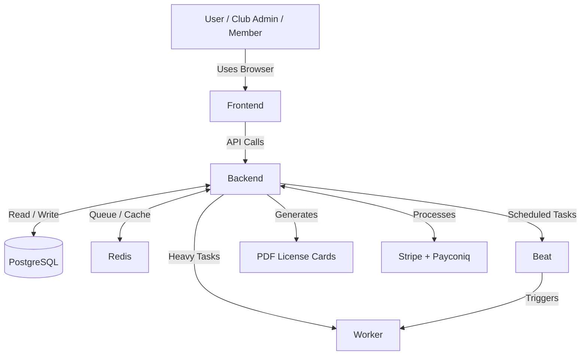

# LTF Taekwondo License Manager — Architecture

This document gives a high-level overview of how the entire system works.

## Overview

The LTF Taekwondo License Manager is a web application that allows the Luxembourg Taekwondo Federation (LTF), clubs, coaches, and members to manage memberships, licenses, grades, payments, and printed license cards.

The system is built using modern technologies and follows a clear separation of concerns for reliability and maintainability.

---

## System Components

| Component       | Purpose                                      | Technology                          | Docker Container |
|-----------------|----------------------------------------------|-------------------------------------|------------------|
| **Frontend**    | User interface and interaction               | Next.js 16.2 + React + TypeScript   | `frontend`       |
| **Backend**     | Business logic, API, rules, PDF generation   | Django 6.0.3 + DRF                  | `backend`        |
| **Database**    | Permanent data storage                       | PostgreSQL 18                       | `db`             |
| **Redis**       | Task queue and caching                       | Redis 8.4                           | `redis`          |
| **Worker**      | Background heavy tasks                       | Celery Worker                       | `worker`         |
| **Beat**        | Scheduled tasks                              | Celery Beat                         | `beat`           |

---

## Detailed Documentation

For more information, see the following documents:

- **[Data Flow & User Journeys](data-flow.md)** — How data moves through the system from the user's perspective
- **[Backend](components/backend.md)** — Business logic and core processing
- **[Frontend](components/frontend.md)** — User interface and experience
- **[Database](components/database.md)** — Data storage and persistence
- **[Redis](components/redis.md)** — Queue and caching
- **[Worker](components/worker.md)** — Background task execution
- **[Beat](components/beat.md)** — Scheduler for recurring tasks
- **[Glossary](glossary.md)** — Explanation of key terms

---

## High-Level Architecture Diagram

## Key Design Principles

- Clear separation between Frontend and Backend
- Background tasks are handled asynchronously (Worker + Beat)
- No direct database access from Frontend
- All containers run as non-root users where possible
- .cursor folder is **not** mounted into containers to prevent ownership issues

---

**Last updated:** 2026-03-22