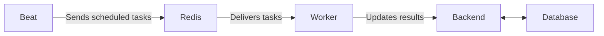

# Beat Component (Scheduler)

## Overview

The **Beat** service is the scheduler of the LTF Taekwondo License Manager. It is responsible for running tasks automatically at specific times or intervals.

- **Technology**: Celery Beat
- **Runs in**: Docker container (same image as Backend and Worker)
- **Nickname**: "The Clock" or "Scheduler"

---

## What Does Beat Do?

While the **Worker** executes heavy tasks, **Beat** decides *when* those tasks should run.

It acts like an alarm clock that triggers background jobs on a schedule.

### Examples of Scheduled Tasks

- **Every minute**: Check and reconcile pending Stripe payments
- **Every hour**: Activate licenses that have been paid but not yet activated
- **Daily**: Clean up old temporary files and artifacts
- **Periodic**: Send license expiration reminders to members and clubs

These automated tasks ensure the system stays up-to-date without requiring manual intervention.

---

## How It Works

1.  Beat runs continuously in the background.
2.  It checks its schedule (stored in the database via Redis).
3.  When it’s time for a task, Beat sends a message to **Redis**.
4.  The **Worker** picks up the message and executes the actual work.
5.  Results are saved back to the **Database** through the Backend.

---

## Relationship With Other Components

- **Beat** = decides *when*
- **Redis** = delivers the instruction
- **Worker** = does the actual work
- **Backend** = coordinates and saves results

---

## Summary for Non-Technical Users

Think of **Beat** as the reliable office manager who makes sure routine but important tasks happen on time.

While everyone else is busy with daily work, Beat quietly checks the calendar and says:

- “It’s time to check if all payments went through.”
- “It’s time to activate the licenses that were paid last hour.”
- “It’s time to clean up old files.”

It doesn’t do the heavy work itself — it delegates to the **Worker** — but without Beat, many important background processes would never run automatically.

### Current Scheduled Tasks (as of v0.3.8)

- reconcile_pending_stripe_orders — every minute
- activate_eligible_paid_licenses — hourly
