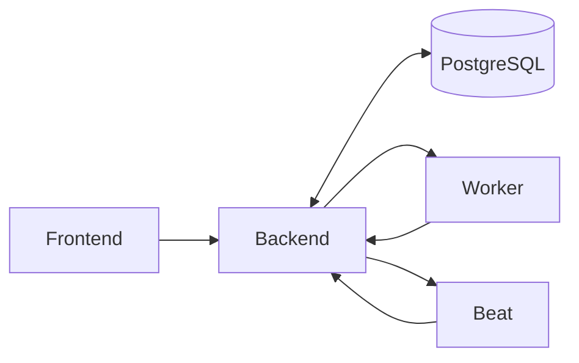

# Database Component

## Overview

The **Database** is the permanent storage system of the LTF Taekwondo License Manager. It holds all important information about members, licenses, clubs, payments, print history, and more.

- **Technology**: PostgreSQL 18
- **Runs in**: Docker container (`postgres:18-alpine`)
- **Volume**: `postgres_data` (persistent storage)

---

## What Does the Database Store?

The database is the single source of truth for the application. It contains:

### Main Data Types

- **Users & Accounts** — Login information, roles, permissions
- **Members** — Personal details, photos, license history, roles (Member, Coach, Volunteer, Staff, etc.)
- **Clubs** — Club information, administrators, branding assets
- **Licenses** — All issued licenses, their status, validity periods, and types
- **Payments & Invoices** — Orders, invoices, payment records (Stripe & Payconiq)
- **Print Jobs** — History of printed license cards, printer profiles used, PDF artifacts
- **Audit History** — Who changed what and when (using django-simple-history)
- **System Settings** — Card templates, printer profiles, grade definitions, etc.

---

## Why PostgreSQL?

PostgreSQL was chosen because it is:
- Very reliable and stable
- Excellent at handling complex relationships
- Good at full-text search and reporting
- Well-supported and widely used in professional applications

---

## How It Interacts With Other Components

- The **Backend** is the only component that directly reads from and writes to the Database.
- The **Frontend** never talks directly to the Database — it always goes through the Backend APIs.
- **Worker** and **Beat** also access the Database through the Backend (or directly in some background tasks).

All data changes are carefully controlled by the Backend to maintain data integrity and security.

---

## Data Flow Summary

---
## Summary for Non-Technical Users
Think of the Database as the secure filing cabinet of the entire system.
Everything important is stored here: who the members are, which licenses they have, whether they’ve paid, and what cards have been printed.

The Backend is like the careful librarian who organizes everything and makes sure only authorized people can read or change the files.
