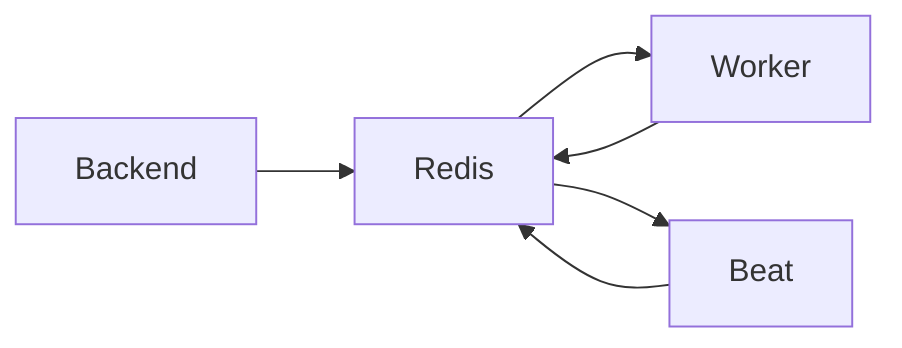

# Redis Component

## Overview

**Redis** is a fast, in-memory data store that serves two critical purposes in the LTF Taekwondo License Manager:

- Acting as a **message broker** (task queue)
- Providing **fast caching** and temporary data storage
- **Technology**: Redis 8.4
- **Runs in**: Docker container (`redis:8-alpine`)
- **Volume**: `redis_data` (persistent storage)

---

## What Does Redis Do?

Redis is not used to store long-term business data (that job belongs to PostgreSQL). Instead, it handles high-speed, short-lived operations.

### Main Roles

1.  **Task Queue (Message Broker)**
    
    - Celery (the background task system) uses Redis to pass jobs between the Backend and the Worker/Beat services.
    - When the Backend needs to generate a PDF, send an email, or reconcile payments, it puts the task into Redis.
    - The **Worker** picks up these tasks and executes them in the background.
2.  **Caching**
    
    - Stores frequently accessed data temporarily to improve performance (e.g. session data, frequently viewed member lists).
3.  **Rate Limiting & Temporary Storage**
    
    - Helps manage background job scheduling and temporary states during complex operations.

---

## Why Redis?

Redis is extremely fast because it keeps data in memory (RAM) instead of on disk. This makes it perfect for:

- Real-time task queuing
- High-performance caching
- Reliable communication between different parts of the application

---

## How It Interacts With Other Components

- The Backend pushes tasks into Redis queues.
- The Worker and Beat read tasks from Redis and report back.
- All three components (Backend, Worker, Beat) communicate through Redis.

---

## Summary for Non-Technical Users

Think of Redis as the **busy post office** of the system.

When the main office (Backend) has too much work — like generating many license cards or checking payments — it doesn’t do everything immediately. Instead, it writes a note (“Please generate this PDF”) and drops it into the post office (Redis).

The workers (Worker and Beat services) regularly check the post office, pick up the notes, and do the actual work in the background. This keeps the main system fast and responsive for users.
