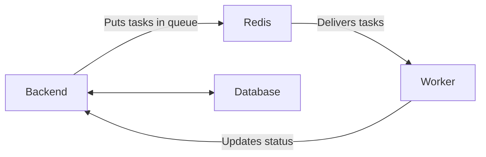

# Worker Component

## Overview

The **Worker** is responsible for handling heavy, time-consuming, or background tasks so that the main application stays fast and responsive for users.

- **Location**: Runs as part of the backend codebase
- **Technology**: Celery Worker
- **Runs in**: Docker container (same image as Backend)

---

## What Does the Worker Do?

While the Backend handles quick requests (like showing a dashboard or saving a form), some tasks are too slow or resource-heavy to do immediately. These tasks are sent to the **Worker**.

### Main Responsibilities

- Generating PDF license cards (especially for bulk printing)
- Processing payment webhooks from Stripe and Payconiq
- Sending confirmation and reminder emails
- Reconciling pending payments with Stripe
- Processing large imports or data updates
- Cleaning up old temporary files and artifacts

These tasks run **asynchronously** in the background, so users don’t have to wait.

---

## How It Works

1.  The **Backend** receives a request that requires heavy work (e.g. "Print 50 license cards").
2.  Instead of doing it immediately, the Backend puts the task into a queue stored in **Redis**.
3.  The **Worker** continuously checks Redis for new tasks.
4.  When it finds a task, it processes it (e.g. generates PDFs, sends emails).
5.  Once finished, the Worker updates the status in the **Database** through the Backend.

This design prevents the website from becoming slow when many users are active at the same time.

---

## Relationship With Other Components

- **Backend** creates background jobs
- **Redis** acts as the message queue
- **Worker** executes the jobs
- **Database** stores the final results

---

## Summary for Non-Technical Users

Imagine the Backend as a busy receptionist at a busy office.

When someone asks for something complicated (like printing many cards or processing payments), the receptionist doesn’t stop helping other people. Instead, they write a note and hand it to a specialized team in the back room — the **Worker**.

The Worker team quietly completes these longer tasks in the background while the receptionist continues serving users quickly.

This is why the website feels fast even when complex operations are happening behind the scenes.
