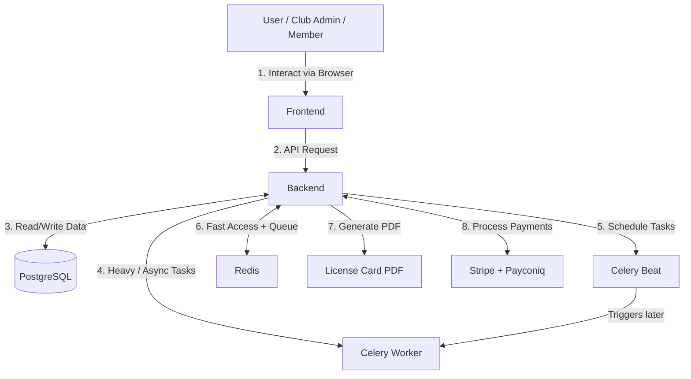

# LTF Taekwondo License Manager — Data Flow & User Journeys

This document explains how data moves through the system when users perform common actions. It is written for both non-technical users and developers.

## 1. High-Level System Flow

## 2. Common User Journeys

### Journey A: Member Applies for a License

1.  Member logs in on the website → **Frontend**
2.  Fills out the license application form → Frontend sends data to **Backend**
3.  Backend validates the data and saves a draft license in the **Database**
4.  Member proceeds to payment → Backend creates an Order and Invoice
5.  User pays via Stripe or Payconiq → Backend receives a webhook notification
6.  **Worker** processes the payment confirmation in the background
7.  Backend updates the license status to "Paid"
8.  **Beat** (scheduler) later activates the license at the correct time
9.  Member can now view and print their official license card

### Journey B: Club Admin Prints Licenses

1.  Club Admin selects multiple members → **Frontend**
2.  Chooses a printer profile and clicks "Quick Print"
3.  Frontend sends print request to **Backend**
4.  Backend creates PrintJob records in the **Database**
5.  Backend queues the jobs for the **Worker**
6.  **Worker** generates the PDF license cards (applying correct offsets)
7.  PDFs are stored and links are returned to the user
8.  All actions are logged for audit purposes

### Journey C: Automated Background Tasks

- **Every minute**: Beat triggers reconciliation of pending Stripe payments → Worker processes them
- **Hourly**: Beat activates newly paid licenses
- **Periodic**: Worker cleans up old files and sends reminder emails

## 3. Component Responsibilities

| Component | Main Responsibility | Triggered By | Technology |
| --- | --- | --- | --- |
| **Frontend** | User interface and interaction | Human user | Next.js + React |
| **Backend** | Business logic, validation, API | Frontend + Webhooks | Django + DRF |
| **Database** | Persistent storage of all data | Backend | PostgreSQL |
| **Redis** | Caching and task queue | Backend + Celery | Redis |
| **Worker** | Heavy and background processing | Backend (via queue) | Celery Worker |
| **Beat** | Scheduled and recurring tasks | Time-based | Celery Beat |